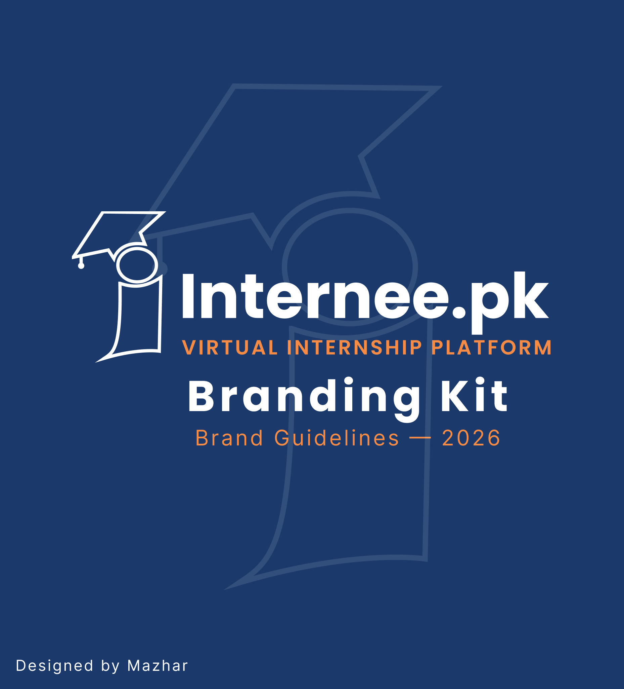
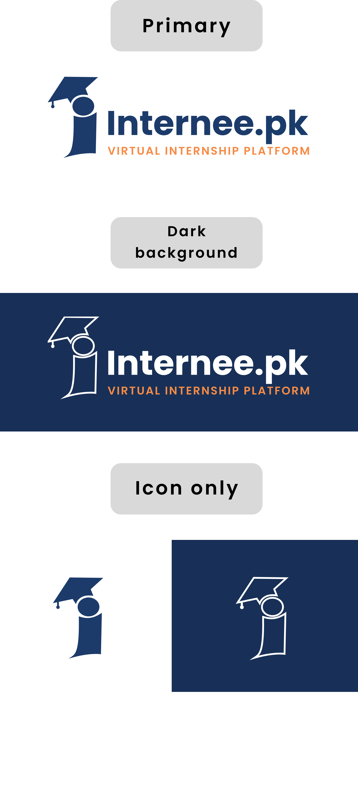
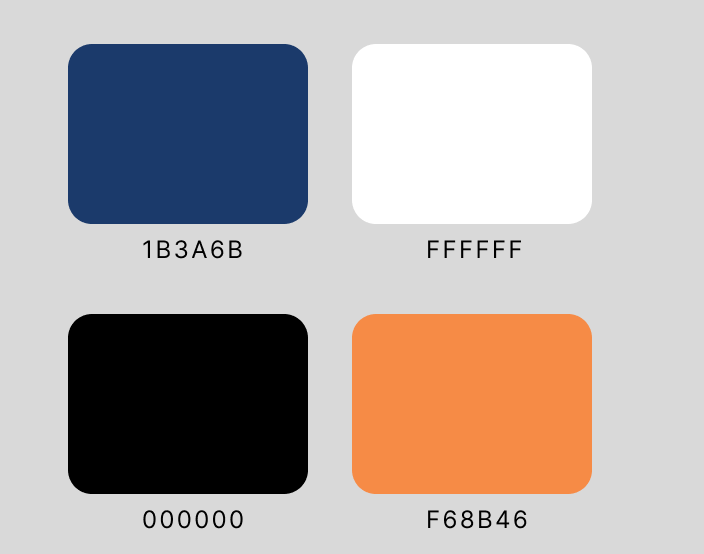
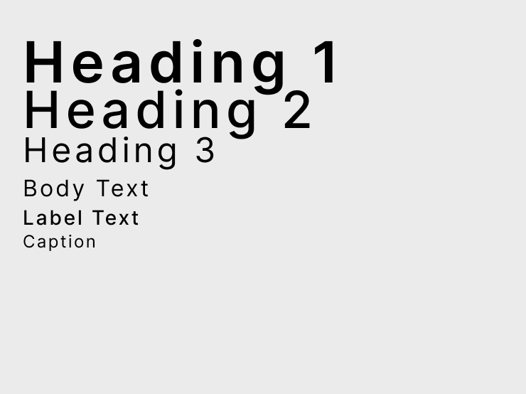
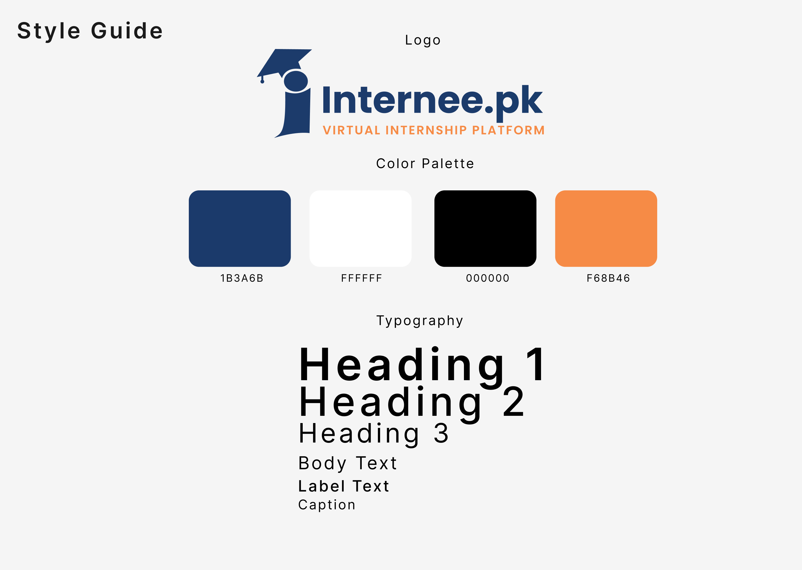
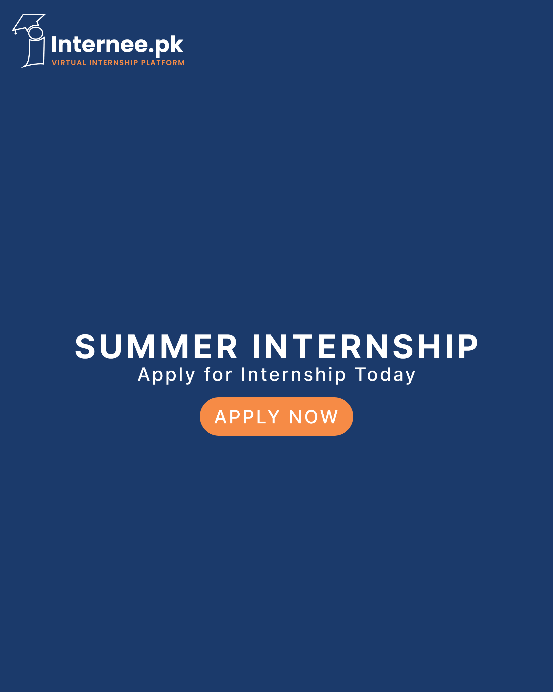
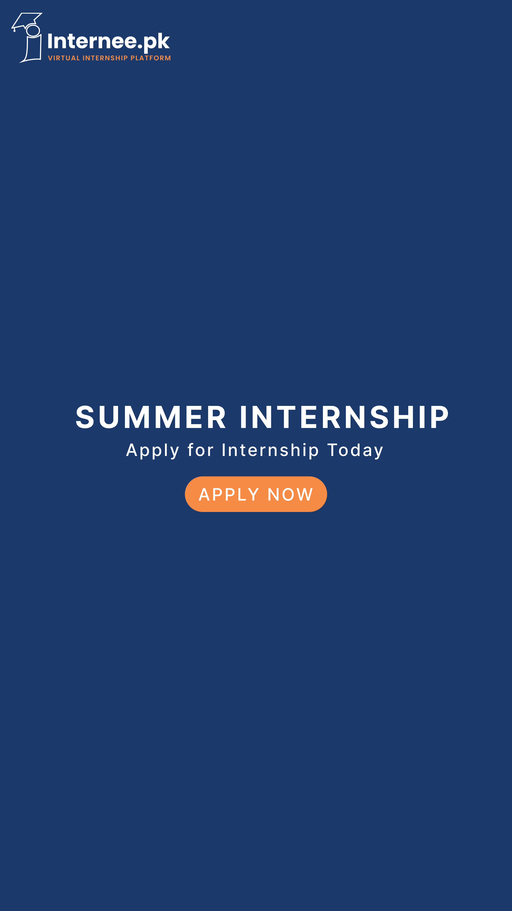

# Internee.pk Branding Kit

A complete brand identity system designed for Internee.pk, created during my Graphic Design internship.

## What's Included
- Logo variations (primary, dark background, light background, icon-only)
- Color palette
- Typography system (Poppins + Inter)
- Style guide
- Social media templates (Instagram post + story)

## Tools Used
Figma, Adobe Illustrator

## View the Design
🔗 [Live Figma Prototype](https://www.figma.com/design/VHcgyahNHduRUCelxos9Sr/Internee.pk-Branding-Kit?node-id=7-63&t=71h1bRzPdyo8LRti-1)

## Preview

## About
Designed by Mazhar during a Graphic Design internship with Internee.pk (June–August 2026).
